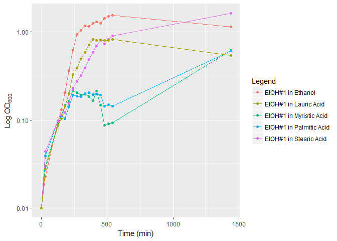
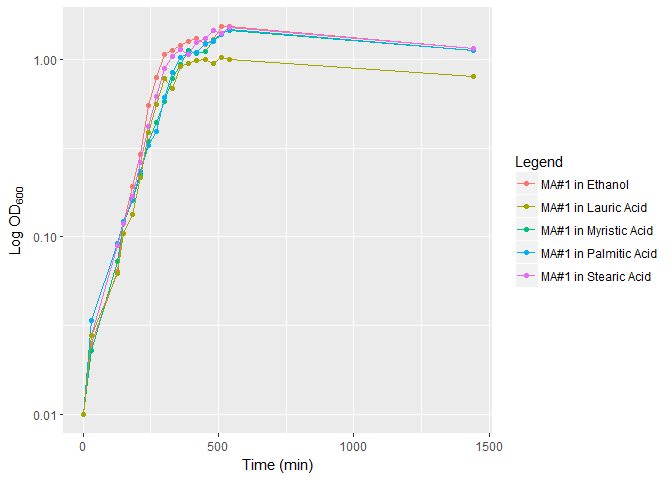
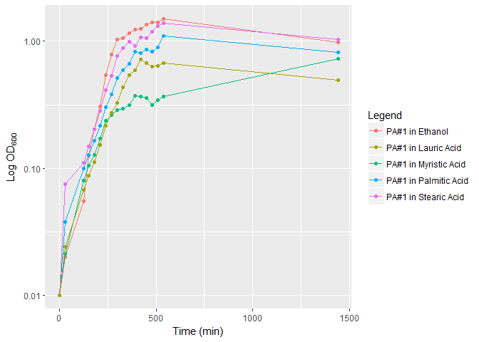

Introduction
============

*Enterococcus faecalis* is a gram-positive human gut bacterium which is
a pathogen of interest as it is often a causative factor of a large
number and variety of opportunistic infections, including
gastroenteritis, urinary tract infections, and bacteremia in
immunocompromised patients. In previous research, it has been shown to
uptake exogenous fatty acids, such as those often found in bile, into
its membrane. However; the uptake of particular fatty acids, especially
myristic acid and palmitic acid, occurs at some cost to the bacterium,
often causing slowed growth and cell deformation. Mutant substrains of
*E. faecalis* were previously generated by growing OG1RF in media
supplemented with either myristic acid or palmitic acid dissolved in
ethanol. Control substrains were also generated by growing OG1RF in
media supplemented with ethanol. Here, we characterize the growth of
these control and mutant strains of bacteria in several saturated fatty
acids.

Methods
=======

Cultures of *E. faecalis* OG1RF, substrains EtOH\#1 (control), MA\#1,
and PA\#1 (mutants) were grown at 37°C in 5 mL BHI (Brain heart
infusion) overnight. These were diluted to optical densities of 0.01 at
600 nm in 25 mL of BHI and were supplemented with ethanol and each of
the following fatty acids:

-   Myristic acid (C14:0) at 5 μg/mL
-   Palmitic acid (C16:0) at 5 μg/mL
-   Stearic acid (C18:0) at 20 μg/mL
-   Lauric acid (C12:0) at 20 μg/mL

The supplemented bacteria were grown at 37°C and the optical density at
600 nm was measured every 30 min. The optical density was then plotted
on a log scale against the elapsed time.

Results
=======

    ####################Plots for growth of EtOH1, MA#1 and PA#1 in fatty acids#####################
    library(ggplot2) # load ggplot2 library
    data <- read.csv("../data/Sep15_2016_Growth_EtOH1_MA1_PA1_Strains.csv") # read in growth data
    ####Generate plot showing growth of EtOH#1 in the different saturated fatty acids and ethanol####
    ggplot(data, aes(x=Time, y=value, color = Legend)) + 
      geom_line(aes(y=EtOH1_in_Ethanol_OD600, col = "EtOH#1 in Ethanol")) +
      geom_point(aes(y=EtOH1_in_Ethanol_OD600, col = "EtOH#1 in Ethanol")) +
      geom_line(aes(y=EtOH1_in_myristic_OD600, col = "EtOH#1 in Myristic Acid")) +
      geom_point(aes(y=EtOH1_in_myristic_OD600, col = "EtOH#1 in Myristic Acid")) +
      geom_line(aes(y=EtOH1_in_palmitic_OD600, col = "EtOH#1 in Palmitic Acid")) +
      geom_point(aes(y=EtOH1_in_palmitic_OD600, col = "EtOH#1 in Palmitic Acid")) +
      geom_line(aes(y=EtOH1_in_stearic_OD600, col = "EtOH#1 in Stearic Acid")) +
      geom_point(aes(y=EtOH1_in_stearic_OD600, col = "EtOH#1 in Stearic Acid")) +
      geom_line(aes(y=ETOH1_in_lauric_OD600, col = "EtOH#1 in Lauric Acid")) +
      geom_point(aes(y=ETOH1_in_lauric_OD600, col = "EtOH#1 in Lauric Acid")) +
      scale_y_log10() +
      ylab(expression(paste("Log ", OD[600], sep="")))+
      xlab("Time (min)")

The EtOH\#1 substrain showed growth in the supplements which would be
typically expected of wild-type *E. faecalis* OG1RF. Ethanol, stearic
acid, and lauric acid affected the growth minimally, and both myristic
and palmitic acid caused the optical density to level off at values
between 0.2 and 0.3. The 24-hour time point showed that the optical
density increased to just under 1.0, possibly indicating a takeover of
the culture by a new mutant substrain after its prolonged exposure to
myristic acid or palmitic acid.

    ####Generate plot showing growth of MA#1 in the different saturated fatty acids and ethanol####
    ggplot(data, aes(x=Time, y=value, color = Legend)) + 
      geom_line(aes(y=MA1_in_ethanol_OD600, col = "MA#1 in Ethanol")) +
      geom_point(aes(y=MA1_in_ethanol_OD600, col = "MA#1 in Ethanol")) +
      geom_line(aes(y=MA1_in_myristic_OD600, col = "MA#1 in Myristic Acid")) +
      geom_point(aes(y=MA1_in_myristic_OD600, col = "MA#1 in Myristic Acid")) +
      geom_line(aes(y=MA1_in_palmitic_OD600, col = "MA#1 in Palmitic Acid")) +
      geom_point(aes(y=MA1_in_palmitic_OD600, col = "MA#1 in Palmitic Acid")) +
      geom_line(aes(y=MA1_in_stearic_OD600, col = "MA#1 in Stearic Acid")) +
      geom_point(aes(y=MA1_in_stearic_OD600, col = "MA#1 in Stearic Acid")) +
      geom_line(aes(y=MA1_in_lauric_OD600, col = "MA#1 in Lauric Acid")) +
      geom_point(aes(y=MA1_in_lauric_OD600, col = "MA#1 in Lauric Acid")) +
      scale_y_log10() +
      ylab(expression(paste("Log ", OD[600], sep="")))+
      xlab("Time (min)")

The MA\#1 substrain showed incredibly different growth characteristics
in the fatty acids, with an especially strong difference in its growth
when supplemented with myristic and palmitic acid. Instead of leveling
off in the mid-log stage of growth as observed in EtOH\#1, MA\#1
appeared to be completely unfazed by supplementation with myristic and
palmitic acid, and grew in it as if it were completely unsupplemented.
Lauric acid appeared to have a slight effect on the growth of MA\#1, as
it leveled off at a slightly lower optical density than observed in
growth supplemented with ethanol or the other saturated fatty acids.

    ####Generate plot showing growth of PA#1 in the different saturated fatty acids and ethanol####
    ggplot(data, aes(x=Time, y=value, color = Legend)) + 
      geom_line(aes(y=PA1_in_ethanol_OD600, col = "PA#1 in Ethanol")) +
      geom_point(aes(y=PA1_in_ethanol_OD600, col = "PA#1 in Ethanol")) +
      geom_line(aes(y=PA1_in_myristic_OD600, col = "PA#1 in Myristic Acid")) +
      geom_point(aes(y=PA1_in_myristic_OD600, col = "PA#1 in Myristic Acid")) +
      geom_line(aes(y=PA1_in_palmitic_OD600, col = "PA#1 in Palmitic Acid")) +
      geom_point(aes(y=PA1_in_palmitic_OD600, col = "PA#1 in Palmitic Acid")) +
      geom_line(aes(y=PA1_in_stearic_OD600, col = "PA#1 in Stearic Acid")) +
      geom_point(aes(y=PA1_in_stearic_OD600, col = "PA#1 in Stearic Acid")) +
      geom_line(aes(y=PA1_in_lauric_OD600, col = "PA#1 in Lauric Acid")) +
      geom_point(aes(y=PA1_in_lauric_OD600, col = "PA#1 in Lauric Acid")) +
      scale_y_log10() +
      ylab(expression(paste("Log ", OD[600], sep="")))+
      xlab("Time (min)")

PA\#1 grew differently than either EtOH\#1 or MA\#1. Notably, palmitic
acid appeared to have a less detrimental effect on the growth of PA\#1
than it had on the growth of EtOH\#1, although myristic still appeared
to have a detrimental effect, if not as pronounced as in EtOH\#1.

Discussion
==========

The differences of growth between the control strains and mutant strains
were remarkable, especially when supplemented with myristic and palmitic
acid. Myristic and palmitic acid appeared to have a less detrimental
effect on the growth of MA\#1 and PA\#1 than on EtOH\#1, although there
were apparent differences between the MA\#1 and PA\#1 strains as well.
One possible hypothesis which might explain this phenomenon is that
certain mutations may have arisen in the mutant strains' DNA which
allowed them to better handle growth in myristic and palmitic acid.
