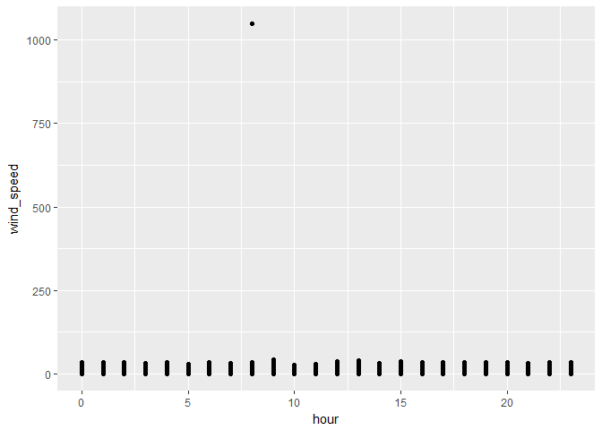
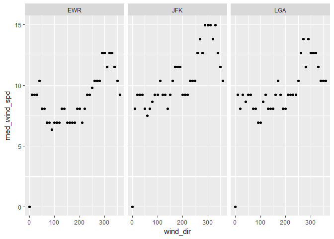
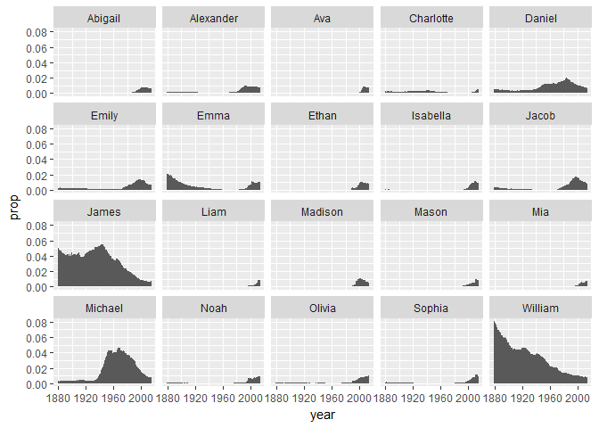

NYC Flights Code
================

    ###task 7 nycflights code###
    #loading appropriate libraries
    library(nycflights13)
    library(tidyverse)

    ## Loading tidyverse: ggplot2
    ## Loading tidyverse: tibble
    ## Loading tidyverse: tidyr
    ## Loading tidyverse: readr
    ## Loading tidyverse: purrr
    ## Loading tidyverse: dplyr

    ## Conflicts with tidy packages ----------------------------------------------

    ## filter(): dplyr, stats
    ## lag():    dplyr, stats

    mf <- nycflights13::weather

    #plot to visualise outliers
    nycflights13::weather %>%
      ggplot(aes(hour, wind_speed)) +
        geom_point()

    ## Warning: Removed 3 rows containing missing values (geom_point).

    #remove outlier > 1,000 units of wind speed and values in wind_dir = NA, summarise with median wind speed for each wind direction at each airport
    airport_wind <- nycflights13::weather %>%
      filter(wind_speed<1000, !is.na(wind_dir)) %>%
      group_by(wind_dir,origin) %>%
      summarise(med_wind_spd = median(wind_speed)) %>%
      .[order(.$origin),]

    #create and plot separate tables of median wind speed/direction for every airport
    airport_wind_tbls <- airport_wind %>%
      group_by(origin) %>%
      do(airport_wind=data.frame(.)) %>%
      select(airport_wind) %>%
      lapply(function(x) {(x)}) %>%
      print()

    ## $airport_wind
    ## $airport_wind[[1]]
    ##    wind_dir origin med_wind_spd
    ## 1         0    EWR      0.00000
    ## 2        10    EWR      9.20624
    ## 3        20    EWR      9.20624
    ## 4        30    EWR      9.20624
    ## 5        40    EWR     10.35702
    ## 6        50    EWR      8.05546
    ## 7        60    EWR      8.05546
    ## 8        70    EWR      6.90468
    ## 9        80    EWR      6.90468
    ## 10       90    EWR      6.32929
    ## 11      100    EWR      6.90468
    ## 12      110    EWR      6.90468
    ## 13      120    EWR      6.90468
    ## 14      130    EWR      8.05546
    ## 15      140    EWR      8.05546
    ## 16      150    EWR      6.90468
    ## 17      160    EWR      6.90468
    ## 18      170    EWR      6.90468
    ## 19      180    EWR      6.90468
    ## 20      190    EWR      8.05546
    ## 21      200    EWR      8.05546
    ## 22      210    EWR      6.90468
    ## 23      220    EWR      8.05546
    ## 24      230    EWR      9.20624
    ## 25      240    EWR      9.20624
    ## 26      250    EWR      9.78163
    ## 27      260    EWR     10.35702
    ## 28      270    EWR     10.35702
    ## 29      280    EWR     10.35702
    ## 30      290    EWR     12.65858
    ## 31      300    EWR     12.65858
    ## 32      310    EWR     11.50780
    ## 33      320    EWR     12.65858
    ## 34      330    EWR     12.65858
    ## 35      340    EWR     11.50780
    ## 36      350    EWR     10.35702
    ## 37      360    EWR      9.20624
    ## 
    ## $airport_wind[[2]]
    ##    wind_dir origin med_wind_spd
    ## 1         0    JFK      0.00000
    ## 2        10    JFK      8.05546
    ## 3        20    JFK      9.20624
    ## 4        30    JFK      9.20624
    ## 5        40    JFK      9.20624
    ## 6        50    JFK      8.05546
    ## 7        60    JFK      7.48007
    ## 8        70    JFK      8.05546
    ## 9        80    JFK      8.63085
    ## 10       90    JFK      9.20624
    ## 11      100    JFK      9.20624
    ## 12      110    JFK     10.35702
    ## 13      120    JFK      9.20624
    ## 14      130    JFK      9.20624
    ## 15      140    JFK      8.05546
    ## 16      150    JFK      9.20624
    ## 17      160    JFK     10.35702
    ## 18      170    JFK     11.50780
    ## 19      180    JFK     11.50780
    ## 20      190    JFK     11.50780
    ## 21      200    JFK      9.20624
    ## 22      210    JFK      9.20624
    ## 23      220    JFK      9.20624
    ## 24      230    JFK     10.35702
    ## 25      240    JFK     10.35702
    ## 26      250    JFK     10.35702
    ## 27      260    JFK     12.65858
    ## 28      270    JFK     13.80936
    ## 29      280    JFK     12.65858
    ## 30      290    JFK     14.96014
    ## 31      300    JFK     14.96014
    ## 32      310    JFK     14.96014
    ## 33      320    JFK     13.80936
    ## 34      330    JFK     14.96014
    ## 35      340    JFK     12.65858
    ## 36      350    JFK     11.50780
    ## 37      360    JFK     10.35702
    ## 
    ## $airport_wind[[3]]
    ##    wind_dir origin med_wind_spd
    ## 1         0    LGA      0.00000
    ## 2        10    LGA      9.20624
    ## 3        20    LGA      8.05546
    ## 4        30    LGA      9.20624
    ## 5        40    LGA      8.63085
    ## 6        50    LGA      9.20624
    ## 7        60    LGA      9.20624
    ## 8        70    LGA      8.05546
    ## 9        80    LGA      8.05546
    ## 10       90    LGA      6.90468
    ## 11      100    LGA      6.90468
    ## 12      110    LGA      8.63085
    ## 13      120    LGA      9.20624
    ## 14      130    LGA      8.05546
    ## 15      140    LGA      8.05546
    ## 16      150    LGA      8.05546
    ## 17      160    LGA      9.20624
    ## 18      170    LGA     10.35702
    ## 19      180    LGA      9.20624
    ## 20      190    LGA      8.05546
    ## 21      200    LGA      8.05546
    ## 22      210    LGA      9.20624
    ## 23      220    LGA      9.20624
    ## 24      230    LGA      9.20624
    ## 25      240    LGA      9.20624
    ## 26      250    LGA     10.35702
    ## 27      260    LGA     12.65858
    ## 28      270    LGA     13.80936
    ## 29      280    LGA     11.50780
    ## 30      290    LGA     13.80936
    ## 31      300    LGA     12.65858
    ## 32      310    LGA     12.65858
    ## 33      320    LGA     12.65858
    ## 34      330    LGA     11.50780
    ## 35      340    LGA     10.35702
    ## 36      350    LGA     10.35702
    ## 37      360    LGA     10.35702

    #make graphs of median wind speed/direction for every airport
    airport_wind %>%
      ggplot(aes(x=wind_dir, y=med_wind_spd)) +
        geom_point() +
        facet_wrap(~origin) +
        xlab("Wind Direction") +
        ylab("Wind Speed")

    #Make table with airline name and median distance flown from JFK; arrange in order of decreasing mean flight distance
    jfk_flight_distance <- nycflights13::flights %>%
      left_join(airlines) %>%
      filter(origin == "JFK") %>%
      group_by(name) %>%
      summarise(med_dist = median(distance), mean_dist = mean(distance)) %>%
      .[order(.$mean_dist), ] %>%
      print()

    ## Joining, by = "carrier"

    ## # A tibble: 10 × 3
    ##                        name med_dist mean_dist
    ##                       <chr>    <dbl>     <dbl>
    ## 1  ExpressJet Airlines Inc.      228  228.8303
    ## 2                 Envoy Air      425  401.4698
    ## 3         Endeavor Air Inc.      427  506.8903
    ## 4           JetBlue Airways     1028 1113.6737
    ## 5           US Airways Inc.      541 1127.4407
    ## 6    American Airlines Inc.     1598 1660.8528
    ## 7      Delta Air Lines Inc.     1990 1689.3074
    ## 8            Virgin America     2475 2495.1196
    ## 9     United Air Lines Inc.     2586 2535.5922
    ## 10   Hawaiian Airlines Inc.     4983 4983.0000

    #Make wide data frame displaying number of flights leaving Newark airport each month from each airline
    leave_ewr <- nycflights13::flights %>%
      filter(origin == "EWR") %>%
      group_by(carrier, month) %>%
      summarise(flight_num = n()) %>%
      spread(carrier, flight_num) %>%
      print()

    ## # A tibble: 12 × 13
    ##    month  `9E`    AA    AS    B6    DL    EV    MQ    OO    UA    US    VX
    ## *  <int> <int> <int> <int> <int> <int> <int> <int> <int> <int> <int> <int>
    ## 1      1    82   298    62   573   279  3838   212    NA  3657   363    NA
    ## 2      2    75   268    56   532   249  3480   196    NA  3433   328    NA
    ## 3      3    91   295    62   612   319  3996   228    NA  3913   372    NA
    ## 4      4    88   288    60   567   364  3870   220    NA  4025   361   170
    ## 5      5   103   297    62   517   377  4039   226    NA  3874   381   186
    ## 6      6    88   291    60   506   347  3661   218     2  3931   390   180
    ## 7      7    94   303    62   546   340  3747   228    NA  4046   402   181
    ## 8      8    96   302    62   544   355  3636   227    NA  4050   385   182
    ## 9      9    87   282    60   478   423  3425   214    NA  3573   341   161
    ## 10    10   146   292    62   501   440  3587   140    NA  3875   365   170
    ## 11    11   153   277    52   544   418  3392    94     4  3776   346   161
    ## 12    12   165   294    54   637   431  3268    73    NA  3934   371   175
    ## # ... with 1 more variables: WN <int>

Babynames Code
==============

    ###task 7 babynames code###
    library(babynames)

    #collect 10 most common male and female baby names in 2014 
    common.2014 <- babynames::babynames %>%
      filter(year==2014) %>%
      group_by(sex) %>%
      top_n(10, n) %>%
      print()

    ## Source: local data frame [20 x 5]
    ## Groups: sex [2]
    ## 
    ##     year   sex      name     n        prop
    ##    <dbl> <chr>     <chr> <int>       <dbl>
    ## 1   2014     F      Emma 20799 0.010729242
    ## 2   2014     F    Olivia 19674 0.010148906
    ## 3   2014     F    Sophia 18490 0.009538136
    ## 4   2014     F  Isabella 16950 0.008743721
    ## 5   2014     F       Ava 15586 0.008040096
    ## 6   2014     F       Mia 13442 0.006934106
    ## 7   2014     F     Emily 12562 0.006480155
    ## 8   2014     F   Abigail 11985 0.006182507
    ## 9   2014     F   Madison 10247 0.005285953
    ## 10  2014     F Charlotte 10048 0.005183298
    ## 11  2014     M      Noah 19144 0.009431494
    ## 12  2014     M      Liam 18342 0.009036381
    ## 13  2014     M     Mason 17092 0.008420555
    ## 14  2014     M     Jacob 16712 0.008233344
    ## 15  2014     M   William 16687 0.008221027
    ## 16  2014     M     Ethan 15619 0.007694866
    ## 17  2014     M   Michael 15323 0.007549038
    ## 18  2014     M Alexander 15293 0.007534258
    ## 19  2014     M     James 14301 0.007045539
    ## 20  2014     M    Daniel 13829 0.006813003

    #select frequencies throughout the years of the given baby names, plot
    keys <- c("name", "sex")
    babynames::babynames %>%
      merge(., common.2014[keys], by=keys) %>%
      ggplot(aes(x=year, y=prop)) +
        geom_col() +
        facet_wrap(~name)

    common_girls <- babynames::babynames %>%
      filter(year==1896 | year==1942 | year==2016, sex=="F") %>%
      group_by(year) %>%
      top_n(29, prop)  %>%
      top_n(-4, prop) %>%
      print()

    ## Source: local data frame [8 x 5]
    ## Groups: year [2]
    ## 
    ##    year   sex    name     n        prop
    ##   <dbl> <chr>   <chr> <int>       <dbl>
    ## 1  1896     F  Martha  2022 0.008023969
    ## 2  1896     F  Esther  1964 0.007793805
    ## 3  1896     F Frances  1964 0.007793805
    ## 4  1896     F   Edith  1932 0.007666819
    ## 5  1942     F   Helen 10014 0.007202575
    ## 6  1942     F Marilyn  9904 0.007123458
    ## 7  1942     F   Diane  9550 0.006868843
    ## 8  1942     F  Martha  9513 0.006842231
