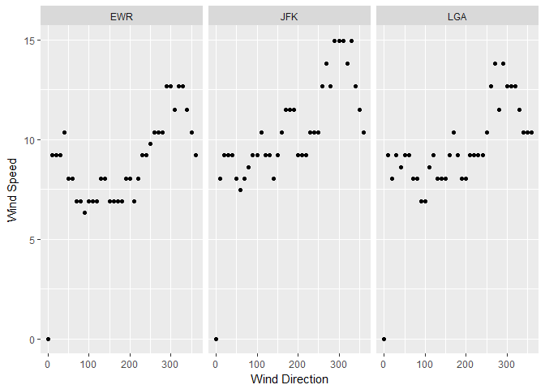

    ###task 7 nycflights code###
    #loading appropriate libraries
    library(nycflights13)
    library(tidyverse)

    ## Loading tidyverse: ggplot2
    ## Loading tidyverse: tibble
    ## Loading tidyverse: tidyr
    ## Loading tidyverse: readr
    ## Loading tidyverse: purrr
    ## Loading tidyverse: dplyr

    ## Conflicts with tidy packages ----------------------------------------------

    ## filter(): dplyr, stats
    ## lag():    dplyr, stats

    #plot to visualise outlier locations
    nycflights13::weather %>%
      ggplot(aes(hour, wind_speed)) +
        geom_point()

    ## Warning: Removed 3 rows containing missing values (geom_point).

    #remove outlier > 1,000 units of wind speed, summarise with median wind speed
    airport_wind <- nycflights13::weather %>%
      filter(wind_speed<1000) %>%
      group_by(origin, wind_dir) %>%
      summarise(med_wind_spd = median(wind_speed))
    #create and plot tables of median wind speed/direction for every airport
    airpot_wind_tbls <- airport_wind %>%
      group_by(origin) %>%
      do(airport_wind=data.frame(.)) %>%
      select(airport_wind) %>%
      lapply(function(x) {(x)}) %>%
      print()

    ## $airport_wind
    ## $airport_wind[[1]]
    ##    origin wind_dir med_wind_spd
    ## 1     EWR        0      0.00000
    ## 2     EWR       10      9.20624
    ## 3     EWR       20      9.20624
    ## 4     EWR       30      9.20624
    ## 5     EWR       40     10.35702
    ## 6     EWR       50      8.05546
    ## 7     EWR       60      8.05546
    ## 8     EWR       70      6.90468
    ## 9     EWR       80      6.90468
    ## 10    EWR       90      6.32929
    ## 11    EWR      100      6.90468
    ## 12    EWR      110      6.90468
    ## 13    EWR      120      6.90468
    ## 14    EWR      130      8.05546
    ## 15    EWR      140      8.05546
    ## 16    EWR      150      6.90468
    ## 17    EWR      160      6.90468
    ## 18    EWR      170      6.90468
    ## 19    EWR      180      6.90468
    ## 20    EWR      190      8.05546
    ## 21    EWR      200      8.05546
    ## 22    EWR      210      6.90468
    ## 23    EWR      220      8.05546
    ## 24    EWR      230      9.20624
    ## 25    EWR      240      9.20624
    ## 26    EWR      250      9.78163
    ## 27    EWR      260     10.35702
    ## 28    EWR      270     10.35702
    ## 29    EWR      280     10.35702
    ## 30    EWR      290     12.65858
    ## 31    EWR      300     12.65858
    ## 32    EWR      310     11.50780
    ## 33    EWR      320     12.65858
    ## 34    EWR      330     12.65858
    ## 35    EWR      340     11.50780
    ## 36    EWR      350     10.35702
    ## 37    EWR      360      9.20624
    ## 38    EWR       NA      4.60312
    ## 
    ## $airport_wind[[2]]
    ##    origin wind_dir med_wind_spd
    ## 1     JFK        0      0.00000
    ## 2     JFK       10      8.05546
    ## 3     JFK       20      9.20624
    ## 4     JFK       30      9.20624
    ## 5     JFK       40      9.20624
    ## 6     JFK       50      8.05546
    ## 7     JFK       60      7.48007
    ## 8     JFK       70      8.05546
    ## 9     JFK       80      8.63085
    ## 10    JFK       90      9.20624
    ## 11    JFK      100      9.20624
    ## 12    JFK      110     10.35702
    ## 13    JFK      120      9.20624
    ## 14    JFK      130      9.20624
    ## 15    JFK      140      8.05546
    ## 16    JFK      150      9.20624
    ## 17    JFK      160     10.35702
    ## 18    JFK      170     11.50780
    ## 19    JFK      180     11.50780
    ## 20    JFK      190     11.50780
    ## 21    JFK      200      9.20624
    ## 22    JFK      210      9.20624
    ## 23    JFK      220      9.20624
    ## 24    JFK      230     10.35702
    ## 25    JFK      240     10.35702
    ## 26    JFK      250     10.35702
    ## 27    JFK      260     12.65858
    ## 28    JFK      270     13.80936
    ## 29    JFK      280     12.65858
    ## 30    JFK      290     14.96014
    ## 31    JFK      300     14.96014
    ## 32    JFK      310     14.96014
    ## 33    JFK      320     13.80936
    ## 34    JFK      330     14.96014
    ## 35    JFK      340     12.65858
    ## 36    JFK      350     11.50780
    ## 37    JFK      360     10.35702
    ## 38    JFK       NA      4.60312
    ## 
    ## $airport_wind[[3]]
    ##    origin wind_dir med_wind_spd
    ## 1     LGA        0      0.00000
    ## 2     LGA       10      9.20624
    ## 3     LGA       20      8.05546
    ## 4     LGA       30      9.20624
    ## 5     LGA       40      8.63085
    ## 6     LGA       50      9.20624
    ## 7     LGA       60      9.20624
    ## 8     LGA       70      8.05546
    ## 9     LGA       80      8.05546
    ## 10    LGA       90      6.90468
    ## 11    LGA      100      6.90468
    ## 12    LGA      110      8.63085
    ## 13    LGA      120      9.20624
    ## 14    LGA      130      8.05546
    ## 15    LGA      140      8.05546
    ## 16    LGA      150      8.05546
    ## 17    LGA      160      9.20624
    ## 18    LGA      170     10.35702
    ## 19    LGA      180      9.20624
    ## 20    LGA      190      8.05546
    ## 21    LGA      200      8.05546
    ## 22    LGA      210      9.20624
    ## 23    LGA      220      9.20624
    ## 24    LGA      230      9.20624
    ## 25    LGA      240      9.20624
    ## 26    LGA      250     10.35702
    ## 27    LGA      260     12.65858
    ## 28    LGA      270     13.80936
    ## 29    LGA      280     11.50780
    ## 30    LGA      290     13.80936
    ## 31    LGA      300     12.65858
    ## 32    LGA      310     12.65858
    ## 33    LGA      320     12.65858
    ## 34    LGA      330     11.50780
    ## 35    LGA      340     10.35702
    ## 36    LGA      350     10.35702
    ## 37    LGA      360     10.35702
    ## 38    LGA       NA      5.75390

    #make graphs of median wind speed/direction for every airport
    airport_wind %>%
      ggplot(aes(x=wind_dir, y=med_wind_spd)) +
        geom_point() +
        facet_wrap(~origin)

    ## Warning: Removed 3 rows containing missing values (geom_point).

    ###task 7 babynames code###
    library(babynames)
    #collect 10 most common male and female baby names in 2014 
    common.2014 <- babynames::babynames %>%
      filter(year==2014) %>%
      group_by(sex) %>%
      top_n(10, n) %>%
      .[[3]]
    #select frequencies throughout the years of the given baby names
    babynames::babynames %>%
      filter(name %in% common.2014) %>%
      ggplot(aes(x=year, y=prop)) +
        geom_col() +
        facet_wrap(~name)

